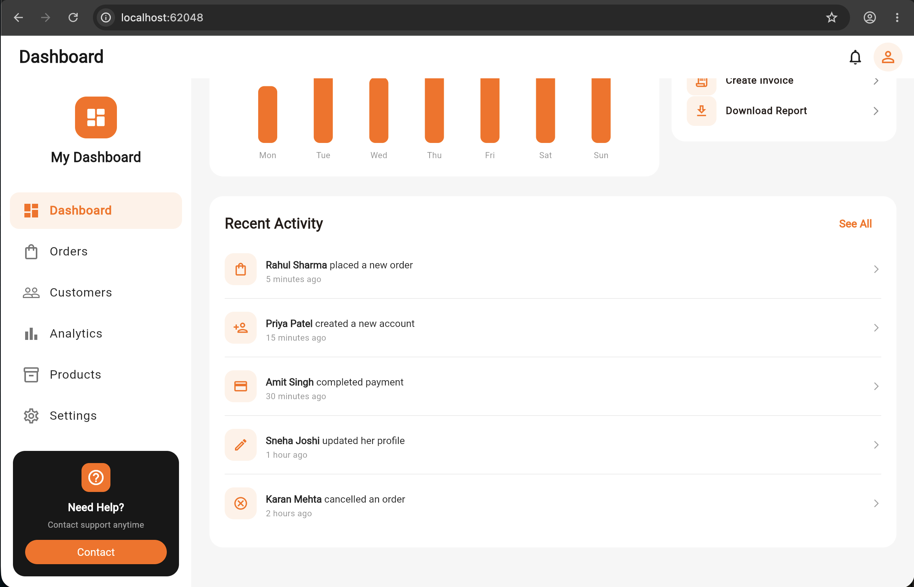
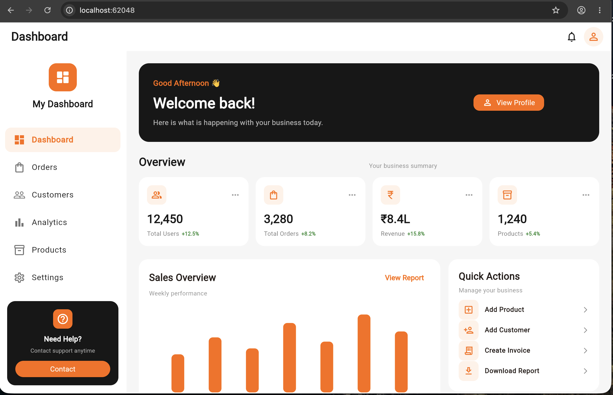

# 🟧 Responsive Dashboard

<div align="center">

### A Modern Responsive Flutter Dashboard

**Mobile • Tablet • Desktop**

Built with Flutter using  
`ListView` • `GridView` • `MediaQuery` • `Expanded` • `Flexible`

<br>


</div>

---

## 📊 Project Overview

<div align="center">


</div>

---

## ✨ Preview

A clean **Orange + White + Black** dashboard designed to adapt automatically to different screen sizes.

### 🖥️ Desktop

<div align="center">



</div>

### 📱 Responsive Views

<div align="center">



</div>

---

## 🎯 Objective

The goal of this project is to build a **multi-section responsive dashboard** using Flutter's built-in responsive layout capabilities.

The interface automatically adapts according to the available screen width instead of using a fixed layout.

### Core Flutter concepts

```text
MediaQuery
     ↓
Detect Screen Width
     ↓
┌──────────────┬──────────────┬──────────────┐
│    Mobile    │    Tablet    │   Desktop    │
│   < 600px    │ 600–1099px   │  ≥ 1100px    │
└──────────────┴──────────────┴──────────────┘
     ↓
Adaptive Dashboard
